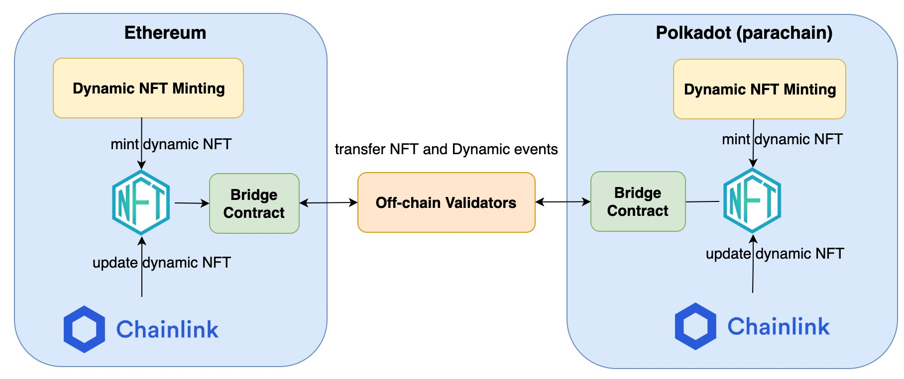

# Architecture

UniqueX Protocol has following key modules, which are “first-of-kind” in both Ethereum and Polkadot:
* **Dynamic NFT Minting:** users can create their own dynamic NFT in this minting platform for their unique assets. The NFT is dynamic and responsive to the off-chain events. For example, it can be burnt after a specific expiration date or upgrade itself upon a specific off-chain event reported from ChainLink.
* **Token Bridge for dynamic NFTs:**
    * UniqueX provides a “first-of-kind” two-way bridge which can transfer both “static” and “dynamic” NFT along with corresponding events (e.g., upgrade NFTs) across Blockchains.
    * The oracle service triggers the token contract to upgrade dynamic NFT in the original network, while the token has been transferred to another blockchain. It is required for token bridge to transfer the “dynamic” events across blockchain networks to update transferred NFTs.
    * Existing bridge projects can only transfer tokens. Therefore, they are not fit for “dynamic” NFTs.
    

